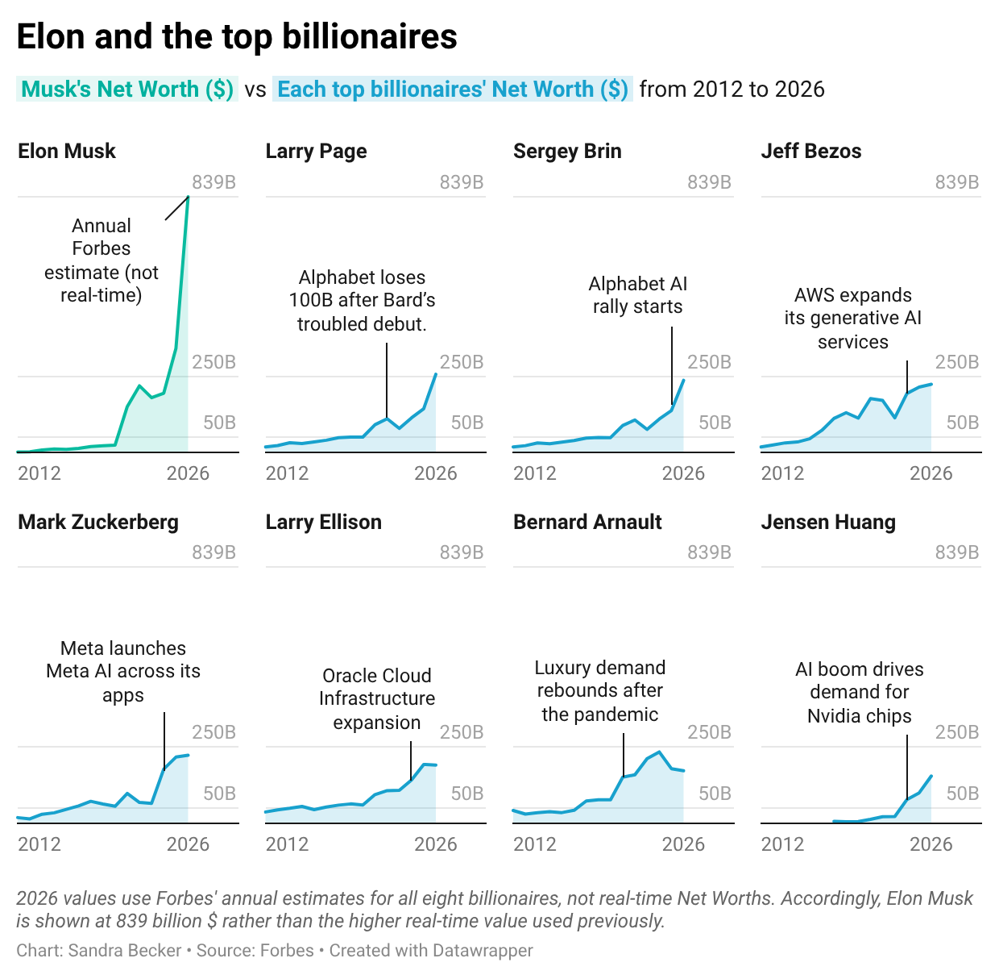
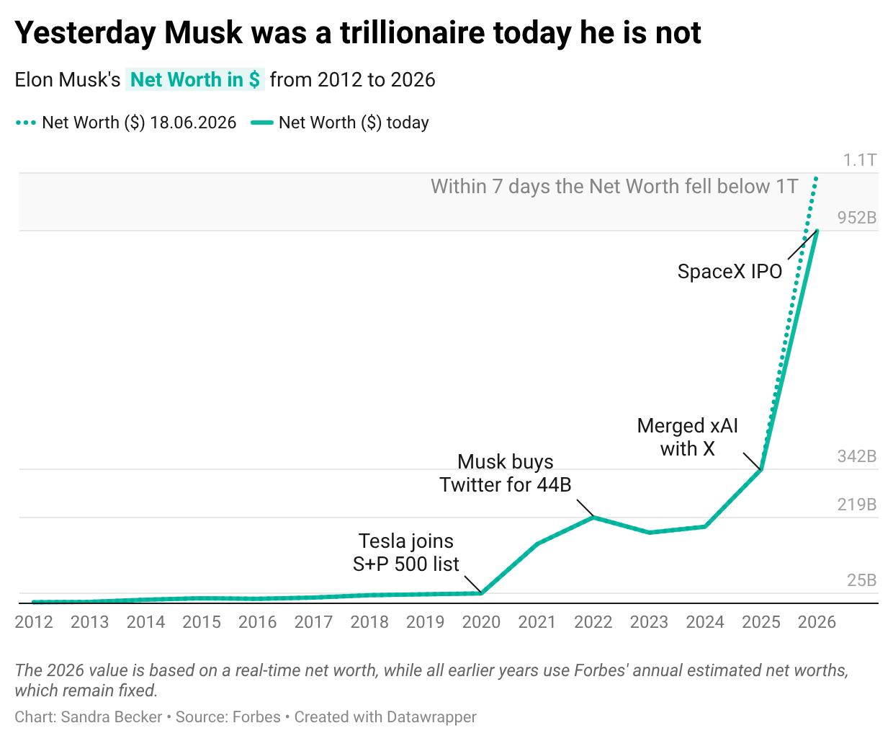
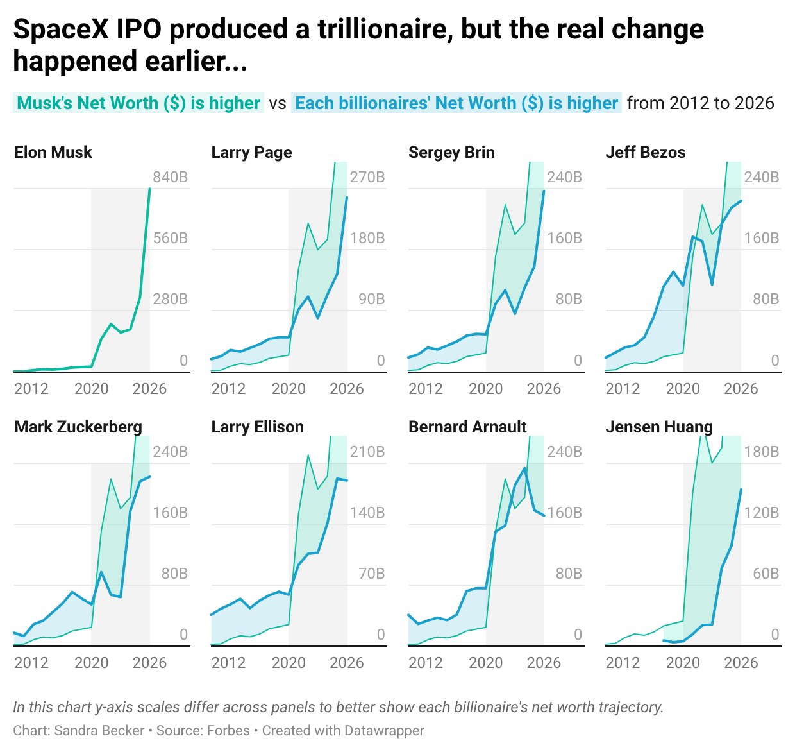

This is a blogpost in Datawrapper format using explanatory data visualization using Forbes billionaire data on the volatility of wealth over time and a reminder that scale can completely change what a line chart reveals.

